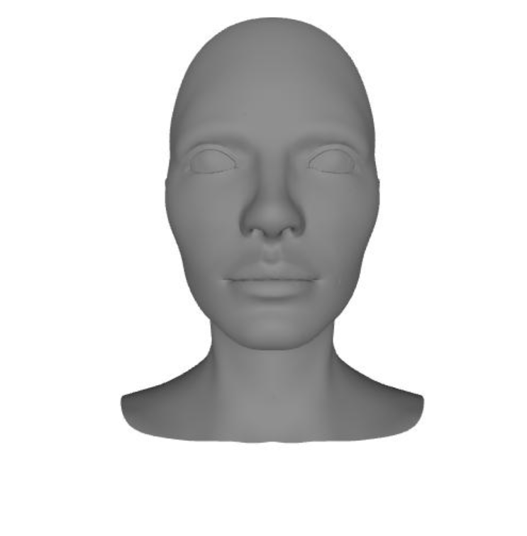
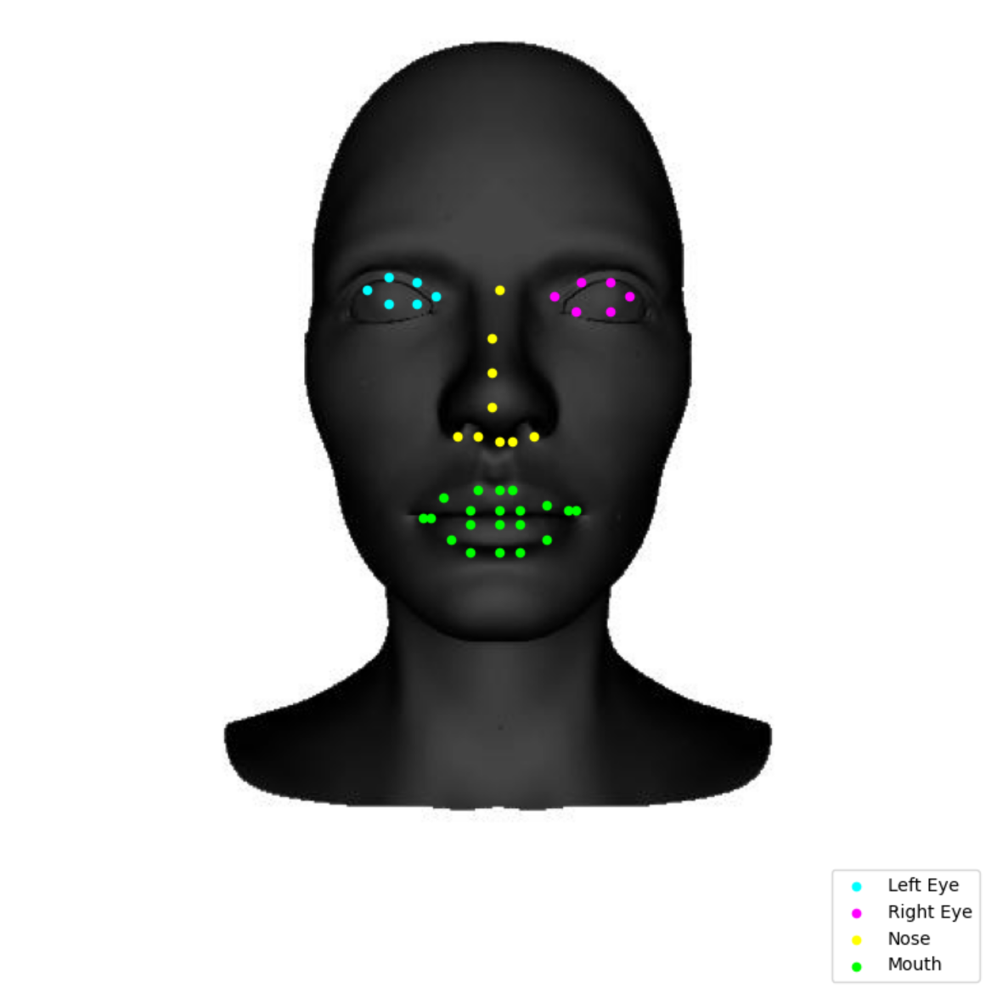
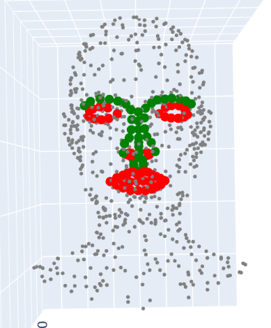
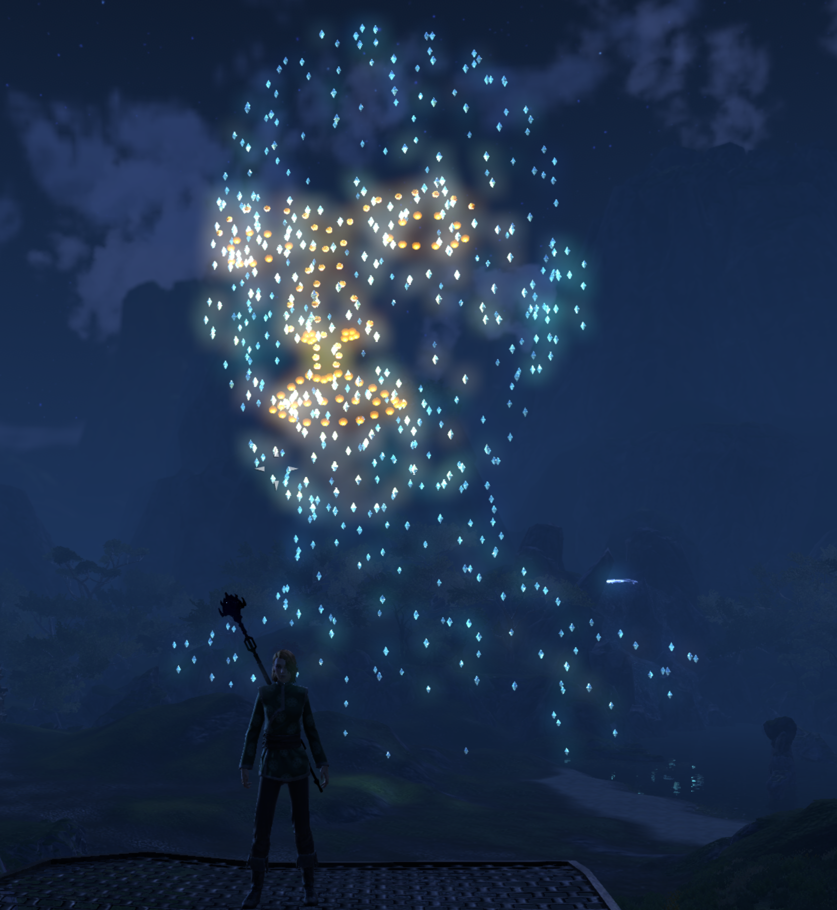
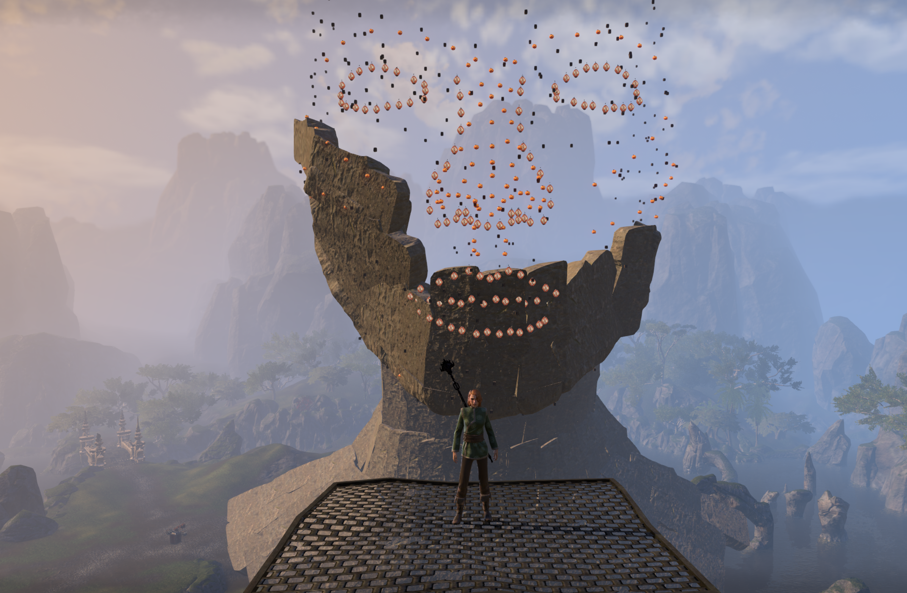
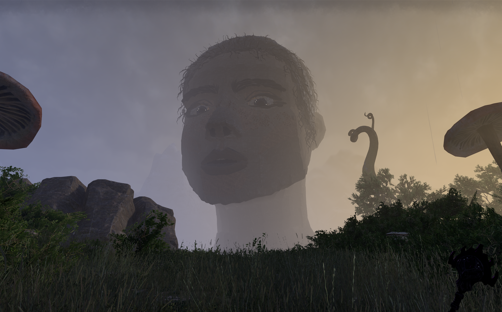
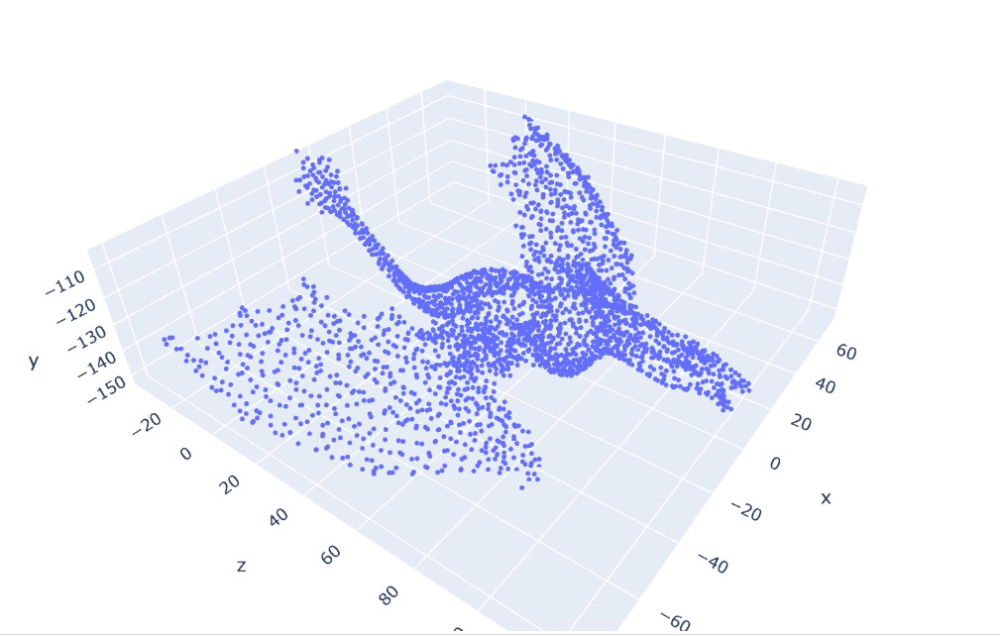
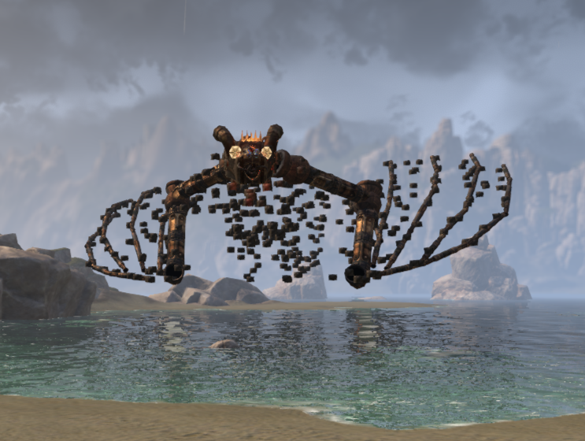
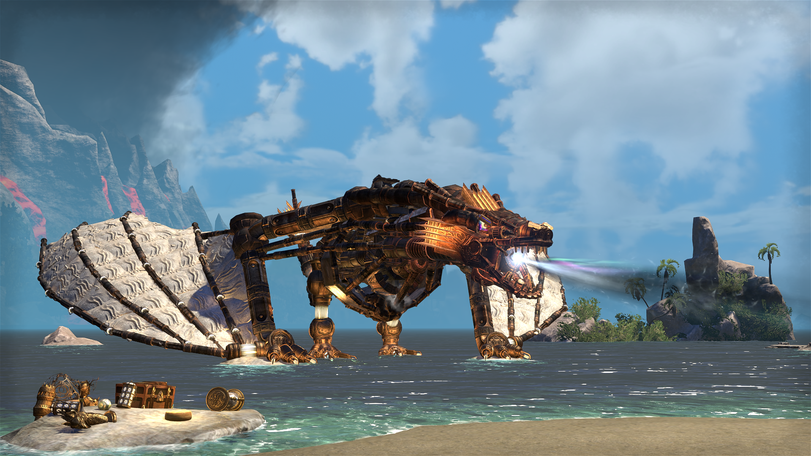

# Mesh to Housing

**Mesh to Housing** is a framework for converting complex 3D models into sparse spatial guides that can be reconstructed inside game housing systems with strict object-count and API constraints.

The core problem is independent of any particular game: given a detailed 3D model and a limited point budget, determine which points best preserve its **geometry, topology, and visually important features**.

The resulting sparse representation can then be translated into different games through separate integration layers.

---

## Overview

```text
3D model
   │
   ▼
Mesh / point-cloud processing
   │
   ├── important-feature detection
   ├── manual anchor points
   └── topology-aware analysis
   │
   ▼
Sparse N-point representation
   │
   ▼
Game-independent guide
   │
   ├── ESO integration
   ├── WoW integration
   └── other game adapters
   │
   ▼
In-game construction guide
```

The geometry-processing pipeline is kept separate from game-specific integrations.

---

## Current Prototype

An early end-to-end prototype has already been tested in **The Elder Scrolls Online**.

The current workflow demonstrates:

- conversion of a 3D model into a point-based representation;
- CV-assisted detection of important features;
- manual refinement of selected points;
- sparsification of the remaining geometry;
- transfer of the resulting guide into the game;
- manual reconstruction using that guide.

### Face example

| Source mesh | CV-assisted feature selection | Sparse guide |
| --- | --- | --- |
|  |  |  |

| In-game guide | Reconstruction in progress | Finished build |
| --- | --- | --- |
|  |  |  |

### Dragon example

A second prototype applies the same general workflow to different geometry.

| Sparse guide | Guide transferred in-game | Finished build |
| --- | --- | --- |
|  |  |  |

The original notebook code used for these experiments is not included in the repository. The current project is intended to turn the prototype into a general and reproducible pipeline.

---

## Core Problem

Standard downsampling can preserve overall surface coverage while losing features that are disproportionately important for reconstruction.

At a fixed point budget, the representation needs to balance:

- geometric coverage;
- important local features;
- manually selected anchors;
- significant topological structure.

For example, if a user selects important points manually or through feature detection, the remaining point budget should be sampled **with those points already taken into account**, rather than generating an independent sparse representation and adding them afterwards.

---

## Planned Methods

Methods will be compared at identical target point counts.

### Geometric baselines

Standard geometric methods such as **uniform sampling, farthest-point sampling, and mesh simplification** will provide reference baselines.

These establish how well the model can be represented using geometry alone.

### Feature-aware sampling

Important points can be fixed before the remaining geometry is sparsified.

They may come from:

- manual anchor selection;
- geometric saliency;
- CV / ML-assisted landmark or feature detection where appropriate.

The remaining points will then be selected while accounting for those existing anchors, allowing the limited point budget to be distributed more effectively over the rest of the model.

### Topology-aware sampling

The project will investigate whether **Topological Data Analysis (TDA)** can improve sparse representations beyond purely geometric methods.

Persistent homology can be used to measure whether important connected structures, loops, or cavities are retained after reduction.

---

## Game Integration

The core pipeline outputs a game-independent set of spatial guide points.

Depending on the capabilities of a particular game, these can be represented in two main ways:

### Direct visualization

Where addon APIs support custom 3D visualization, the guide can be displayed directly in the game as points or markers positioned at the generated coordinates.

### Object-based representation

Where direct visualization is not available, in-game objects can be placed at the guide coordinates to represent the sparse model.

Different objects, colors, or visual markers can also be used to distinguish automatically selected points from important feature or anchor points.

Initial target environments are:

- **The Elder Scrolls Online Housing**
- **World of Warcraft Housing**

Additional games can be supported through separate adapters without changing the core geometry pipeline.

---

## Evaluation

Reduction methods will be compared at the same point budgets using three main criteria:

- **Geometric fidelity** — how well the sparse representation covers the original shape;
- **Feature preservation** — whether important automatic and manually selected features remain represented;
- **Topology preservation** — whether significant structural properties of the original model survive reduction.

A small reference model set will be included for reproducible comparisons, while the pipeline will also support user-provided 3D models.